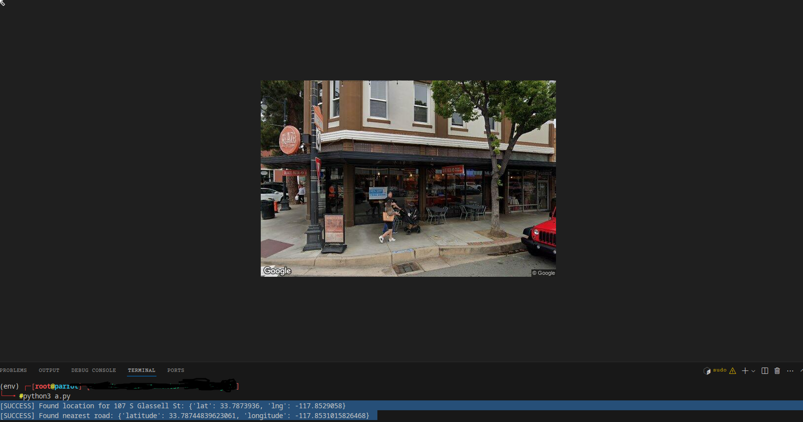

# Street View House Image Fetcher

This project downloads front-facing Street View images for addresses provided in a CSV file using the Google Maps APIs. The script reads address data (Address, City, State, Zip) from `addresses.csv`, retrieves the correct coordinates, calculates the appropriate camera heading using the Roads API, and then saves a Street View image showing the front of the house.



## Features
- **CSV Input:** Provide addresses in a CSV file with the columns:
  - `Address` (optional, if not provided, City, State, and Zip will be used)
  - `City`
  - `State`
  - `Zip`
- **Google API Integration:** Uses the following APIs:
  - **Geocoding API:** Converts the address to latitude and longitude.
  - **Roads API:** Finds the nearest road to calculate the correct camera heading.
  - **Street View Static API:** Fetches the image from Google Street View.
- **Output:** The script saves the images in a folder named `street_view_images` and creates a new CSV (`addresses_with_images.csv`) that includes a column with the local file path of each image.

## Setup Instructions

1. **Clone the Repository:**
   ```bash
   git clone https://github.com/Zzatiz/frontDoorScraper.git
   cd street-view-house-image-fetcher
